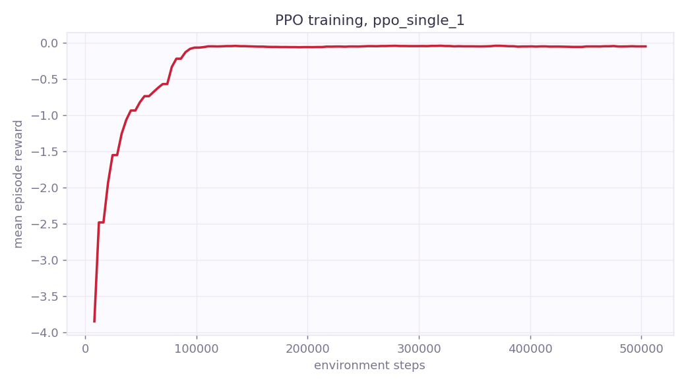

# SmartSignal

Adaptive traffic signal control with reinforcement learning. A PPO agent learns
to drive a SUMO-simulated intersection and is benchmarked — honestly — against
the controllers a real traffic engineer would compare it to: a fixed timer,
SUMO's gap-based actuated control, and max-pressure control.

A live dashboard runs all controllers **side by side on identical traffic**
(same network, same demand, same random seed) and streams the result to the
browser, so the difference is something you can watch, not just a table.

**Live demo:** https://smart-signal-i0v5.onrender.com (free instance — spins
down when idle, first load can take ~30s to wake up)

## Why this design

- **Next-phase actions, not durations.** Every 5 s the agent picks which green
  phase to serve. The environment enforces minimum green (10 s), maximum green
  (60 s, force-rotation), and 3 s yellow transitions — no action sequence can
  produce an unsafe signal state or starve an approach.
- **Dense difference reward.** Reward is the *reduction* in total accumulated
  waiting time on incoming lanes per decision step (the IntelliLight/sumo-rl
  formulation), which is stable to train and directly tied to the headline metric.
- **Honest baselines.** Beating a fixed timer is easy; the credible claim is
  against actuated and max-pressure control, especially on time-varying,
  asymmetric demand where fixed plans hurt the most.
- **Synthetic, seeded demand.** Three profiles (off-peak, asymmetric rush,
  variable ramp-up/down) are generated as deterministic SUMO route files;
  vehicle insertion noise comes from SUMO's `--seed`, so every comparison is
  reproducible. Real-data calibration (TomTom) is deliberately out of the MVP.

## Quick start

```bash
pip install -r requirements.txt

# 1. generate demand + build network (network is checked in; routes regenerate)
python -m smartsignal.demand.generate_routes

# 2. benchmark classical baselines (writes results/baselines.csv)
python -m smartsignal.evaluation.run_eval --controllers fixed actuated maxpressure

# 3. train the PPO agent (~hours on CPU; tensorboard --logdir runs)
python -m smartsignal.training.train_ppo

# 4. evaluate the trained agent against the same scenarios
python -m smartsignal.evaluation.run_eval --controllers rl --model models/ppo_single.zip

# 5. launch the live comparison dashboard
uvicorn dashboard.server:app
# -> http://127.0.0.1:8000
```

The 2×2 grid (multi-intersection coordination) works the same way:

```bash
python scripts/build_grid.py                       # network
python -m smartsignal.demand.generate_grid_routes  # demand
python -m smartsignal.training.train_grid_ppo      # shared policy (~10 min)
python -m smartsignal.evaluation.run_eval --scenario grid2x2 \
    --controllers fixed actuated maxpressure rl
# then pick "grid2x2" in the dashboard's scenario dropdown
```

Watch any controller in SUMO's own GUI:

```bash
python scripts/demo_gui.py rl --profile variable
```

## Results

Mean over 5 seeds, 1-hour episodes. Average waiting time per completed trip (s):

| Controller | off-peak | rush (NS-heavy) | variable |
|---|---|---|---|
| Fixed timer (30 s) | 36.4 ± 0.4 | 39.4 ± 0.2 | 37.7 ± 0.2 |
| Actuated (SUMO) | 7.8 ± 0.0 | 9.2 ± 0.1 | 8.5 ± 0.1 |
| Max-pressure | 3.3 ± 0.1 | 4.2 ± 0.1 | 3.5 ± 0.1 |
| **PPO (SmartSignal)** | **3.4 ± 0.1** | **3.4 ± 0.1** | **3.5 ± 0.1** |

The agent (500k steps, ~35 min on a laptop CPU) cuts waiting time by **~91%
vs the fixed timer** and **~60% vs actuated control** on every profile, matches
max-pressure on balanced demand, and **beats max-pressure by ~19% on the
asymmetric rush profile** — exactly where adaptivity should pay off. It also
posts the highest throughput and lowest CO₂ on that profile.

*(regenerate with `python -m smartsignal.evaluation.report results/baselines.csv results/rl.csv`)*

### Multi-intersection (2×2 grid)

Four junctions, one shared PPO policy with neighbor-aware observations.
Mean over 5 seeds, 1-hour episodes:

| Controller | wait (corridor demand) | wait (balanced) | corridor travel time | stops/vehicle |
|---|---|---|---|---|
| Fixed timer | 85.3 ± 0.3 s | 74.9 ± 1.0 s | 163.5 s | 1.4 |
| Actuated (SUMO) | 16.9 ± 0.3 s | 15.6 ± 0.3 s | 81.0 s | 1.5 |
| Max-pressure | 9.5 ± 0.5 s | 8.9 ± 0.2 s | 68.9 s | 1.0 |
| **PPO shared policy** | **7.4 ± 0.0 s** | **5.8 ± 0.1 s** | **66.7 s** | **1.0** |

The shared policy beats every baseline on the grid — **22–35% less waiting
than max-pressure** — and produces the emergent green-wave effect: corridor
vehicles cross both junctions with ~1 stop and the lowest end-to-end travel
time, without any hand-coded offset coordination.



## Project layout

```
scenarios/             SUMO networks: single intersection + 2x2 grid
smartsignal/env/       Gymnasium env, TrafficSignal safety wrapper, obs/reward,
                       SignalNetwork (neighbor-aware obs), multi-junction VecEnv
smartsignal/controllers/  fixed, actuated, max-pressure, RL — one interface
smartsignal/demand/    demand profiles -> deterministic .rou.xml
smartsignal/training/  SB3 PPO: parallel workers (single) / shared policy (grid)
smartsignal/evaluation/  tripinfo-based benchmark harness -> CSV (+ green-wave metrics)
dashboard/             FastAPI + WebSocket lockstep comparison UI
tests/                 env contract, safety constraints, determinism, grid
```

## Tech

Python · SUMO (libsumo/TraCI) · Gymnasium · Stable-Baselines3 PPO · PyTorch ·
FastAPI + WebSockets · Chart.js

## Roadmap

- RESCO real-city scenario import
- Demand calibration from TomTom historical traffic stats
- Larger grids (the shared-policy VecEnv scales to any junction count)
